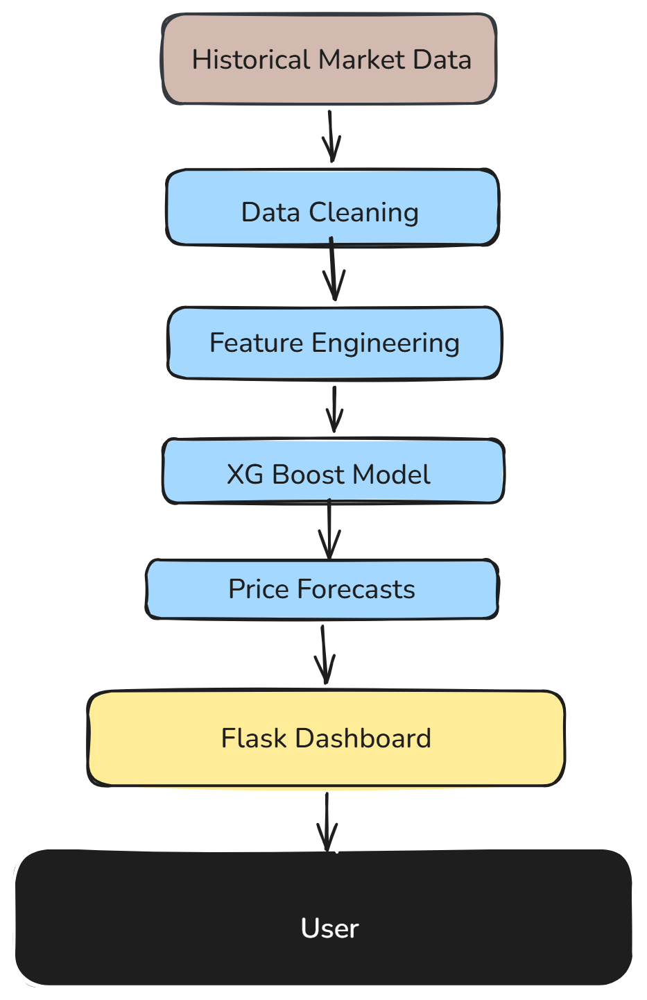
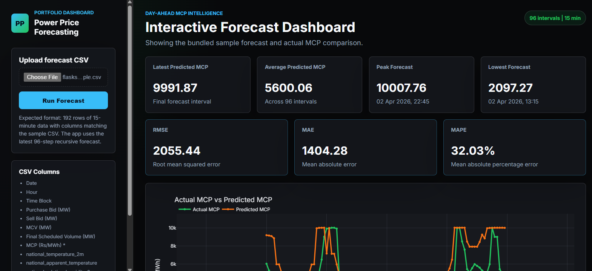

Power Price Forecasting

This project predicts electricity prices using historical market data and XGBoost.

I built it to explore how machine learning can be applied to power markets and price forecasting. The application processes historical data, generates forecasting features, trains an XGBoost model, and displays predictions through a web dashboard.

Built with Python, Flask, Pandas, Scikit-learn, and XGBoost.

## Architecture

The system is designed around a simple forecasting pipeline that processes historical power market data, generates forecasting features, trains an XGBoost model, and serves predictions through a web dashboard.

<h2>Screenshots</h2>

To run locally:

pip install -r requirements.txt
python app.py

The project is still being improved with additional forecasting features, better visualizations, and more robust evaluation of model performance.

Built by Meghana Kasula.
